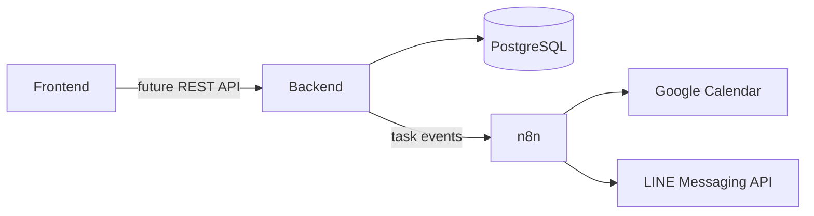

# To Bloom List

To Bloom List 是一個以「一項任務，一株植物」為核心的任務花園。使用者建立待辦時種下幼苗，完成任務後植物依序經過花苞、初綻與盛開。專案目前保留可直接操作的 localStorage 原型，同時建立 Frontend、Backend、Database 三大邊界，為登入、跨裝置同步、31 種植物圖鑑、n8n 與 Google Calendar 整合做準備。

## 版本狀態

目前版本：`0.3.0-architecture-foundation`  
進度基準：2026-07-18

| 領域 | 狀態 | 目前成果 |
| --- | --- | --- |
| Frontend | Prototype / In Progress | 任務 CRUD、拖曳排序、localStorage v2、任務花園、兩種植物四階段、月曆摘要 |
| Backend | Foundation | Express 專案骨架與 `GET /api/health`，尚未接管任務資料 |
| Database | Draft | PostgreSQL schema、兩種現有植物 seed、Calendar 與 n8n 同步資料設計，尚未部署 |
| 31 種植物圖鑑 | Planned | 尚未建立完整物種、120+ 圖片及植物詳細頁 |
| Google Calendar | Planned | 先規劃 To Bloom List 到專用 Calendar 的單向同步 |
| n8n | Planned | 已預留 workflow、事件格式及安全邊界，尚未連接執行環境 |
| LINE | Planned | 後續使用 LINE Messaging API 傳送逾期提醒 |

完整清單請見 [docs/development-status.md](docs/development-status.md)。

## 專案結構

```text
To-Bloom-List/
├─ frontend/                 現有可操作的 Vanilla JavaScript 網頁
│  ├─ index.html
│  ├─ pages/
│  ├─ components/
│  ├─ assets/
│  ├─ css/
│  ├─ js/
│  └─ README.md
├─ backend/                  Express 漸進式骨架
│  ├─ src/
│  ├─ tests/
│  ├─ package.json
│  ├─ .env.example
│  └─ README.md
├─ database/                 PostgreSQL 設計草案
│  ├─ migrations/
│  ├─ seeds/
│  ├─ schema.sql
│  └─ README.md
├─ shared/                   跨層事件格式
├─ automation/n8n/           n8n workflow 預留區
├─ docs/                     架構、API 與進度文件
├─ scripts/serve-frontend.js
└─ package.json
```

## 架構邊界



- Frontend 負責頁面、任務互動、花園、植物動畫與目前的 localStorage 原型。
- Backend 未來負責登入、任務規則、植物解鎖交易、權限與整合事件。
- Database 未來保存帳號、任務、植物物種、收藏、完成歷史與 Calendar 對照。
- n8n 只負責排程和外部服務編排，不作為任務或解鎖資料的唯一來源。
- Google Calendar 是統一時間視圖；To Bloom List 仍是植物成長與完成紀錄的主系統。

## 啟動 Frontend

需求：Node.js 18 以上。

```bash
npm run dev:frontend
```

瀏覽：

```text
http://localhost:5500/
```

也可以使用 Python：

```bash
python -m http.server 5500 --directory frontend
```

Frontend 使用 ES Module 與 `fetch()` 載入共用版面，不可直接以 `file://` 開啟。

檢查 HTML 資源與 JavaScript import 路徑：

```bash
npm run test:frontend
```

## 啟動 Backend 骨架

```bash
cd backend
npm install
cp .env.example .env
npm run dev
```

健康檢查：

```text
GET http://localhost:3000/api/health
```

目前 Frontend 不會呼叫 Backend，兩者並行不會改變既有 localStorage 功能。

## Google Calendar 演進順序

1. 任務增加排程開始與結束時間。
2. 建立使用者專用的 `To Bloom List` Google Calendar。
3. Backend 完成任務 CRUD 與事件 Outbox。
4. n8n 接收 `task.created / updated / deleted` 並建立、更新或刪除 Calendar Event。
5. 保存 `task_id ↔ google_event_id`，確保重試不產生重複事件。
6. 單向同步穩定後，再設計 Calendar 回寫與衝突規則。
7. 逾期未完成任務再由 n8n 經 LINE Messaging API 提醒。

## 下一階段

1. 先提交本次架構整理，保留穩定基線。
2. 將 `js/task-storage.js` 收斂成可替換的 Repository 介面。
3. 建立 31 種植物的物種資料規格、花語與解鎖順序。
4. 完成圖鑑清單與植物詳細頁，再逐步補齊四階段 WebP。
5. 為任務加入排程欄位，完成第一條 n8n → Google Calendar 技術驗證。
6. 最後才加入正式登入、PostgreSQL 與跨裝置同步。

## 本版驗證

2026-07-18 已完成：

- 所有 Frontend 與 Backend JavaScript 語法檢查。
- HTML 本機資源與 JavaScript import 靜態路徑檢查。
- Frontend 啟動後，首頁、五個頁面、共用元件、JS 與 WebP 主要資源均回傳 HTTP 200。
- Backend 測試通過，`GET /api/health` 回傳 `status: ok`，不存在路由回傳 HTTP 404。
- 確認搬入 `frontend/` 的程式碼與最新上傳版本一致；只有 Frontend README 改為新版進度文件。

本次沒有可用的無頭瀏覽器執行檔，因此沒有宣稱完成視覺迴歸測試；解壓後仍建議依 `frontend/README.md` 進行一次人工頁面驗收。

## 文件索引

- [Frontend 開發狀態](frontend/README.md)
- [Backend 開發狀態](backend/README.md)
- [Database 開發狀態](database/README.md)
- [整體架構](docs/architecture.md)
- [API 草案](docs/api.md)
- [n8n 規劃](automation/n8n/README.md)
