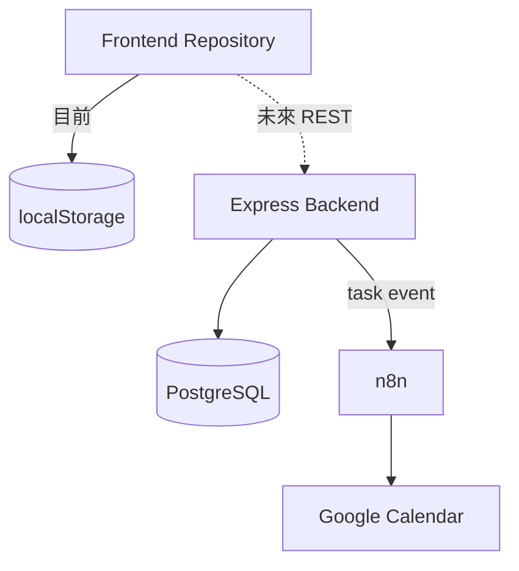

# Architecture

To Bloom List 採漸進式分層：Frontend 0.4.1 仍能單獨使用，Backend、Database 與 n8n 逐步取代本機資料責任。

## 資料所有權

- Frontend：畫面、互動、植物動畫；原型階段暫存任務、收藏與每日進度。
- Backend：未來負責使用者、任務所有權、每日獎勵、選種交易、權限與 automation event。
- Database：任務、完成事件、每日唯一獎勵、固定候選、收藏與 Calendar 對照的權威來源。
- n8n：Google Calendar／LINE 等外部服務編排，不是任務或解鎖主資料庫。
- Google Calendar：統一時間視圖，不取代 To Bloom List 的完成與植物成長規則。

## Repository 切換

頁面透過 task／collection／daily-progress Repository 使用 localStorage。未來建立 API Repository 後，頁面與植物圖鑑不需要分散改寫 storage 呼叫。

## 每日獎勵 transaction

正式版本完成第四個不同任務時應在同一 transaction：

1. 驗證任務屬於使用者。
2. 以 completion event key 防止重複處理。
3. 計算該使用者本地日期的不同完成任務。
4. 以 `(user_id, reward_date)` 唯一限制建立 reward。
5. 從未收藏植物建立最多三筆固定 candidate。
6. 寫入 automation outbox 後一起提交。

選種時鎖定 reward／offer、驗證 candidate、寫入 collection、標記 claimed，全部一次提交。

## Calendar 同步策略

先做 To Bloom List → Google Calendar 單向同步：

- Task event 使用唯一 `eventId`。
- Task 與 Google Event 使用 `task_calendar_links` 一對一對照。
- n8n 重試 create 前必須先檢查既有 Event ID。
- 雙向同步必須等登入、資料庫與衝突規則成熟後再設計。
