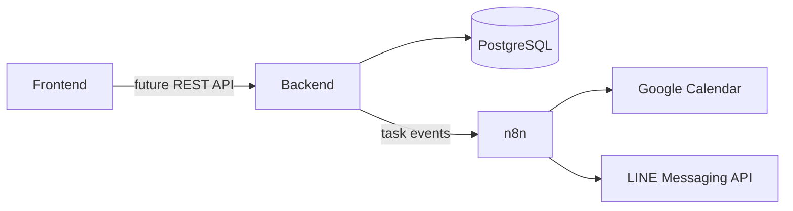

# Architecture

To Bloom List 採漸進式分層。Frontend 目前仍以 localStorage 運作；Backend 與 Database 已建立可演進骨架，但尚未接管任務資料。

## 資料所有權

- Frontend：畫面、互動、植物動畫與目前的 localStorage 原型。
- Backend：未來的登入、任務規則、解鎖交易、權限與整合事件。
- Database：未來的帳號、任務、圖鑑、收藏、完成事件與同步對照。
- n8n：排程及外部服務編排，不擔任任務或解鎖資料的主來源。
- Google Calendar：統一時間視圖，不取代 To Bloom List 的植物成長規則。

## 同步策略

第一階段只做 To Bloom List 到 Google Calendar 的單向同步。每個任務保存唯一的外部 Event ID，避免重試造成重複事件。雙向同步必須等登入、資料庫與衝突規則穩定後才啟用。

